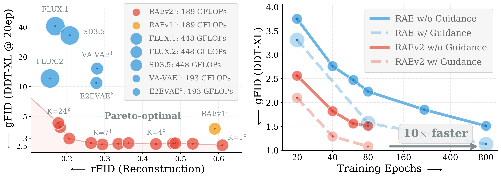

## Improved Baselines with Representation Autoencoders<br><sub>Official PyTorch Implementation</sub>

### [Paper](https://arxiv.org/abs/2605.18324) | [Project Page](https://raev2.github.io)

<p align="center">
  
</p>

This repository contains the **PyTorch/GPU** implementation of our paper:
Improved Baselines with Representation Autoencoders.

> [**Improved Baselines with Representation Autoencoders**](https://arxiv.org/abs/2605.18324)<br>
> [Jaskirat Singh](https://1jsingh.github.io/)<sup>1,2</sup>, [Boyang Zheng](http://bytetriper.github.io/)<sup>3</sup>, [Zongze Wu](https://betterze.github.io/website/)<sup>1</sup>, [Richard Zhang](https://scholar.google.com/citations?user=LW8ze_UAAAAJ&hl=en)<sup>1</sup>, [Eli Shechtman](https://scholar.google.com/citations?user=B_FTboQAAAAJ)<sup>1</sup>, [Saining Xie](https://www.sainingxie.com/)<sup>3</sup><br>
> <sup>1</sup>Adobe Research, <sup>2</sup>ANU, <sup>3</sup>New York University<br>

```bibtex
@article{singh2026raev2,
  title={Improved Baselines with Representation Autoencoders},
  author={Singh, Jaskirat and Zheng, Boyang and Wu, Zongze and Zhang, Richard and Shechtman, Eli and Xie, Saining},
  journal={arXiv preprint arXiv:2605.18324},
  year={2026}
}
```

RAEv2 simplifies and improves representation autoencoders, achieving over 10x faster convergence, better generation, and better reconstruction. RAEv2 achieves state-of-the-art gFID and FDr6 in just 80 epochs compared to prior baselines (800 epochs) without any post-training. We also validate the improved training recipe on diverse settings T2I generation and world models showing consistent improvements.

## Dependency Setup

```bash
git clone https://github.com/nanovisionx/RAEv2.git
cd RAEv2

# install uv project manager (if you don't already have it)
curl -LsSf https://astral.sh/uv/install.sh | sh

# install dependencies
uv sync
```

## Data

Pre-processed datasets at 256x256. All rights to the original owners.

| Subset | Task | Source | Format | Notes |
|---|---|---|---|---|
| `imagenet-256` | ImageNet | [ImageNet](https://image-net.org/) | Arrow | Or use your own ImageNet |
| `blip3o-256` | T2I | [BLIP3o](https://huggingface.co/BLIP3o) | WDS | Captioned image pairs |
| `rendertext-256` | T2I | [RenderedText](https://huggingface.co/datasets/wendlerc/RenderedText) | WDS | Rendered-text images |
| `scale-rae-256` | T2I | [Scale-RAE](https://huggingface.co/datasets/nyu-visionx/scale-rae-data) | WDS | Synthetic FLUX images |
| `recon-256` | NWM | [RECON](https://sites.google.com/view/recon-robot/dataset) | WDS | Robot navigation frames |

```bash
# (Recommended) ~5-10x faster downloads
export HF_HUB_ENABLE_HF_TRANSFER=1

# Download all subsets into data/
uv run hf download nanovisionx/RAEv2-data --repo-type dataset --exclude .gitattributes --local-dir data/

# Or download a specific subset (uncomment one):
# uv run hf download nanovisionx/RAEv2-data --repo-type dataset --exclude .gitattributes --include "imagenet-256/**"     --local-dir data/   # ImageNet
# uv run hf download nanovisionx/RAEv2-data --repo-type dataset --exclude .gitattributes --include "blip3o-256/**"       --local-dir data/   # BLIP3o
# uv run hf download nanovisionx/RAEv2-data --repo-type dataset --exclude .gitattributes --include "rendertext-256/**"  --local-dir data/   # RenderedText
# uv run hf download nanovisionx/RAEv2-data --repo-type dataset --exclude .gitattributes --include "scale-rae-256/**"    --local-dir data/   # Scale-RAE
# uv run hf download nanovisionx/RAEv2-data --repo-type dataset --exclude .gitattributes --include "recon-256/**"        --local-dir data/   # RECON
```

## Pretrained Models

```bash
# Download all (encoders + stage 1 + stage 2)
uv run hf download nyu-visionx/RAEv2-models --exclude .gitattributes --local-dir pretrained_models/

# Or download a specific subset (uncomment one):
# uv run hf download nyu-visionx/RAEv2-models --include "encoders/**" --exclude .gitattributes --local-dir pretrained_models/   # Pretrained vision encoders
# uv run hf download nyu-visionx/RAEv2-models --include "stage1/**"   --exclude .gitattributes --local-dir pretrained_models/   # RAEv2 stage 1 checkpoints
# uv run hf download nyu-visionx/RAEv2-models --include "stage2/**"   --exclude .gitattributes --local-dir pretrained_models/   # RAEv2 stage 2 checkpoints
```

## Stage 1: Generalized Representation Autoencoders

### Training

We support 80+ pre-trained vision encoders across different encoder families and sizes (DINOv2, DINOv3, WebSSL, EUPE, MAE, iJEPA, MoCov3, CLIP, SigLIP2 etc.). See `src/encoders/` for the full list and naming spec.

**Naming**: e.g.
- DINOv3-L: `dinov3-vit-l16`
- DINOv3-L-K7 (multi-layer-sum, last 7 layers): `dinov3mls-vit-l16[layers=11.13.15.17.19.21.23]`

```bash
export WANDB_ENTITY=<your-entity>
export WANDB_PROJECT=<your-project>
export EXPERIMENT_NAME=<your-run-name>

uv run torchrun --nproc_per_node=8 \
    src/train_stage1.py \
    --config <CONFIG_PATH> \
    --results-dir ckpts/stage1 \
    --precision bf16 \
    --compile \
    --wandb
```

**ImageNet config:**
- `configs/stage1/training/dinov3l-k7-imagenet.yaml`
- `configs/stage1/training/dinov3l-k23-imagenet.yaml`

**General Config:** Similar to proprietary VAEs, training with more data helps further improve reconstruction performance.
- `configs/stage1/training/dinov3l-k7-general.yaml`
- `configs/stage1/training/dinov3l-k23-general.yaml`

**After training:** extract the EMA decoder and compute encoder statistics for latent normalization.

```bash
# 1. Extract EMA decoder from the final checkpoint
uv run python scripts/stage1/extract_decoder.py \
    --config <CONFIG_PATH> \
    --ckpt ckpts/stage1/<RUN_NAME>/checkpoints/ep-XXXXXXX.pt \
    --use-ema \
    --out pretrained_models/stage1/<imagenet|general>/<encoder>-k<N>/decoder.pt

# 2. Compute encoder stats (multi-GPU, single node)
uv run torchrun --nproc_per_node=8 \
    scripts/stage1/compute_encoder_stats.py \
    --config <CONFIG_PATH> \
    --use-hf-dataset \
    --hf-data-dir data/imagenet-256 \
    --batch-size 256 \
    --output-path pretrained_models/stage1/<imagenet|general>/<encoder>-k<N>/stats.pt
```

### Evaluation

**Sampling**: reconstruct an image with a trained RAE. See `configs/stage1/sampling/` for the full list. E.g.,

```bash
uv run python scripts/stage1/sample.py \
    --config configs/stage1/sampling/dinov3l-k23-general.yaml \
    --image assets/samples/sample_1.png
```

<p align="center">
  
</p>

**Evaluation**: offline reconstruction metrics (rFID, PSNR, SSIM, LPIPS) on eval datasets (e.g., ImageNet, RenderedText etc).

```bash
export EXPERIMENT_NAME=<your-run-name>

uv run torchrun --nproc_per_node=8 \
    src/offline_eval_stage1.py \
    --config configs/stage1/sampling/dinov3l-k23-general.yaml
```

## Stage 2: Latent Diffusion Transformers

### Training

We support training RAEv2 across diverse settings: ImageNet, text-to-image (T2I), and navigation world models.

```bash
export WANDB_ENTITY=<your-entity>
export WANDB_PROJECT=<your-project>
export EXPERIMENT_NAME=<your-run-name>

uv run torchrun --nproc_per_node=8 \
    src/train.py \
    --config <CONFIG_PATH> \
    --results-dir ckpts/stage2 \
    --precision bf16 \
    --compile \
    --wandb
```

Example training configs for different tasks (all under `configs/stage2/training/`):

| Task | k=1 | k=7 | k=23 |
|---|---|---|---|
| ImageNet | `imagenet-dinov3l-k1.yaml` | `imagenet-dinov3l-k7.yaml` | `imagenet-dinov3l-k23.yaml` |
| T2I | `t2i-dinov3l-k1.yaml` | `t2i-dinov3l-k7.yaml` | `t2i-dinov3l-k23.yaml` |
| NWM | `nwm-dinov3l-k1.yaml` | `nwm-dinov3l-k7.yaml` | `nwm-dinov3l-k23.yaml` |

### Evaluation

**Online Evaluation**: Similar to [JiT](https://github.com/LTH14/JiT), we support online evaluation during training. See the `eval` block in any config under `configs/stage2/training/`.

| Task | Supported metrics |
|---|---|
| Stage 1 - Reconstruction | rFID, PSNR, LPIPS, SSIM |
| Stage 2 - ImageNet | gFID, Inception Score, [FDr6](https://github.com/Jiawei-Yang/FD-loss) (6 representation spaces), [MIND](https://arxiv.org/pdf/2605.06797) / [torch-fidelity](https://github.com/toshas/torch-fidelity) (6 representation spaces) |
| Stage 2 - T2I | GenEval, DPGBench, GenAI Bench, gFID, VQAScore |
| Stage 2 - NWM | LPIPS, gFID |

**Offline Evaluation**: We can also evaluate the model ckpts after training.
```bash
export EXPERIMENT_NAME=<your-run-name>
uv run torchrun --nproc_per_node=8 src/offline_eval.py \
    --config configs/stage2/sampling/imagenet-dinov3l-k7.yaml
```

## Acknowledgments

The codebase is built upon some amazing projects:
- [RAE](https://github.com/bytetriper/RAE)
- [REPA](https://github.com/sihyun-yu/REPA)
- [REPA-E](https://github.com/End2End-Diffusion/REPA-E)
- [iREPA](https://github.com/End2End-Diffusion/iREPA)
- [JiT](https://github.com/LTH14/JiT)

We thank the authors for making their work publicly available. We also sincerely thank Xingjian Leng for support and help with online geneval and dpgbench evaluation during T2I training.

## BibTeX

```bibtex
@article{singh2026raev2,
  title={Improved Baselines with Representation Autoencoders},
  author={Singh, Jaskirat and Zheng, Boyang and Wu, Zongze and Zhang, Richard and Shechtman, Eli and Xie, Saining},
  journal={arXiv preprint arXiv:2605.18324},
  year={2026}
}
```
